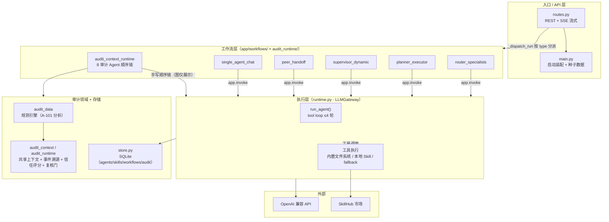

# Agent Playground · 审计智能体后端

> **一句话定位**：把审计程序（分析 → 识别 → 计划 → 凭证核对 → 合同校验 → 函证 → 错报汇总 → 复核）编排为 8 个 AI Agent 接力执行的流水线，通过**共享审计上下文 + 人工复核门**解决多 Agent 一致性与责任闭环问题。

基于 FastAPI + LangGraph + OpenAI 兼容网关构建，内置完整的 A-101 收入审计演示场景，开箱即用。

---

## 一、项目背景

财务报表审计存在大量可标准化的程序性工作（凭证核对、合同校验、函证、截止测试），传统工具只能做单点自动化，难以覆盖"多个角色接力、共享同一套工作底稿、逐级复核"的完整流程。

本项目尝试回答三个问题：

1. **多 Agent 如何共享同一份审计上下文？** —— 设计版本化的共享审计上下文（`Audit.md`），每个 Agent 执行前读取最新全文、执行后必须写回自己的发现，形成可追溯的接力链。
2. **AI 结论如何进入审计责任闭环？** —— 引入**人工复核门（Human Review Gate）**：AI 只负责提示风险与建议，最终决定权保留给审计师，复核决定写回上下文并影响信任评分。
3. **确定性规则与 LLM 如何配合？** —— 异常识别由**规则引擎**（付款方与合同客户一致性、第三方代付授权、期末集中确认、金额勾稽）确定性完成，LLM 负责审计叙事、程序设计与复核建议，避免模型幻觉污染证据链。

## 二、核心亮点

| 亮点 | 说明 |
|---|---|
| 垂直领域深度 | 内置 A-101 收入审计演示：规则引擎从 6 张 CSV（收入/回款/合同/发票/应收/预期结论）识别 **5 笔高风险异常、¥32,000,000 疑似错报**，可一键复现 |
| 共享审计上下文 | 版本化状态（JSON）+ 事件溯源（JSONL）+ Markdown 投影，每次 Agent 写回自动 `version+1`，前端实时收到 SSE 推送 |
| 人工复核闭环 | 复核 Agent 完成后自动生成复核门，审计师可通过 API 提交 approved / need_more_evidence / rejected / escalated 决定，写回审计轨迹 |
| 信任评分 | 从风险证据充分性、证据密度、复核完成率、错报汇总四个维度计算 0–1 可信度 |
| 工程韧性 | 无 API Key 自动降级为规则 fallback；LLM 失败退避重试；工具失败可恢复重试或移除；输出噪声清洗 |

## 三、系统架构



**调用主链**：`POST /api/runs(stream)` → `_dispatch_run()` 按 `workflow.type` 分派 → 通用工作流走 LangGraph `app.invoke()`，审计运行时走手写顺序链 → 各节点调用 `llm_gateway.run_agent()` → OpenAI 工具循环 → 结果落 SQLite + Audit.md 落盘 + SSE 推送。

> **架构演进说明**：`audit_context/` 是第一版（追加写 `Audit.md` + SQLite 快照），`audit_runtime/` 是第二版升级（版本化状态 + JSONL 事件溯源 + 人工复核门 + 信任评分）。两版并存于代码中以保留演进历史，新功能均基于第二版。

## 四、快速开始

### 1. 安装依赖

```bash
pip install -r requirements.txt
```

### 2. 配置（可选）

```bash
cp .env.example .env
# 填入 OPENAI_API_KEY 与 OPENAI_BASE_URL
# 不配置也能运行：系统自动进入无 LLM 的 fallback 演示模式
```

### 3. 复现 A-101 审计演示结果

```bash
python scripts/validate_a101_test_package.py
```

**预期输出**：规则引擎识别 **5 笔高风险异常**，疑似错报金额合计 **¥32,000,000**（付款方与合同客户不一致、合同未允许第三方代付、缺少授权文件、期末集中确认）。

### 4. 启动服务

```bash
python desktop_entry.py
# 服务运行于 http://127.0.0.1:8011 ，健康检查：GET /api/health
```

配置 API Key 后，可通过 `POST /api/runs` 运行 `AuditBrain A-101 Shared Context Runtime` 工作流，观察 8 个审计 Agent 接力写回 `runtime/audit_context/{project}/Audit.md` 的版本演进，并通过 `/api/audit-runtime/{project_id}/review-gates` 提交人工复核决定。

## 五、内置演示场景：A-101 收入虚增——第三方代付

| 项目 | 内容 |
|---|---|
| 风险编号 | A-101 |
| 风险名称 | 收入虚增——第三方代付 |
| 演示数据 | `sample_data/a101_revenue_test/`（6 张 CSV + 42 份证据占位文件） |
| 审计周期 | XX 公司 2025 年度审计（制造业） |
| 重要性水平 | ¥5,000,000 |
| 异常特征 | 付款方 ≠ 合同客户、合同未允许第三方代付、缺授权文件、期末（12/25–12/31）集中确认 |
| 预期结果 | 5 笔高风险异常 / ¥32,000,000 疑似错报（重要性倍数 6.4×） |

## 六、审计 Agent 流水线

| 顺序 | Agent | 对应审计程序 | 上下文写回重点 |
|---|---|---|---|
| 1 | 分析性程序 Agent | 收入趋势与异常波动分析 | agent_findings, evidence_refs |
| 2 | 风险识别 Agent | 重大错报风险识别与认定映射 | risk_register_updates |
| 3 | 审计计划 Agent | 审计响应程序设计 | next_actions |
| 4 | 凭证核对 Agent | 合同/发票/银行回单/验收单四单核对 | evidence_refs |
| 5 | 合同校验 Agent | 第三方代付授权与条款校验 | review_required_items |
| 6 | 函证核对 Agent | 函证设计与回函差异分析 | next_actions |
| 7 | 错报汇总 Agent | 疑似错报金额与重要性判断 | misstatement_summary |
| 8 | 复核 Agent | 人工复核事项与项目经理关注提示 | review_required_items → 触发复核门 |

## 七、技术栈

| 层 | 技术 |
|---|---|
| Web 框架 | FastAPI + Uvicorn（REST + SSE 流式） |
| 工作流编排 | LangGraph（5 种通用多 Agent 模式）+ 审计专用顺序链 |
| LLM 接入 | OpenAI 兼容接口（`chat.completions` + function calling 工具循环） |
| 存储 | SQLite（业务数据）+ JSON/JSONL（审计上下文状态与事件溯源）+ Markdown（Audit.md 投影） |
| 技能系统 | 本地 Skill 定义 + SkillHub 市场（远程搜索/安装） |
| 数据 | 内置 CSV 审计样例包 + 确定性规则引擎 |

## 八、目录结构

```
agent-backend/
├── app/
│   ├── main.py               # FastAPI 入口与启动装配
│   ├── routes.py             # REST + SSE API（~25 组端点）
│   ├── runtime.py            # LLMGateway：路由/规划/Agent 执行/工具运行时
│   ├── store.py              # SQLite 存储层（agents/skills/workflows/audit）
│   ├── settings_bridge.py    # 环境变量与结构化设置管理
│   ├── skillhub_client.py    # SkillHub 市场客户端
│   ├── audit_data/           # A-101 规则引擎（装载/索引/匹配/分析）
│   ├── audit_context/        # 共享审计上下文（第一版：追加写）
│   ├── audit_runtime/        # 共享上下文运行时（第二版：版本化 + 复核门 + 信任评分）
│   └── workflows/            # 6 种工作流定义（LangGraph + 审计顺序链）
├── sample_data/a101_revenue_test/   # A-101 演示数据包
├── scripts/                  # 验证与测试脚本
├── audit_context/            # 演示期生成的 Audit.md 与事件日志
├── requirements.txt
└── desktop_entry.py          # 本地启动入口
```

## 九、API 概览（节选）

| 端点 | 说明 |
|---|---|
| `GET /api/health` | 健康检查 |
| `POST /api/runs` / `POST /api/runs/stream` | 运行工作流（REST / SSE） |
| `GET/POST /api/agents|skills|workflows` | Agent / 技能 / 工作流 CRUD |
| `POST /api/audit-data/analyze-a101-sample` | 执行 A-101 规则引擎分析 |
| `GET /api/audit-runtime/{id}/trust` | 读取信任评分与校验结果 |
| `GET /api/audit-runtime/{id}/review-gates` | 列出人工复核门 |
| `POST /api/audit-review-gates/{gate_id}/decision` | 提交审计师复核决定 |

---

> **项目性质说明**：本项目为研究演示型沙箱（research demo / sandbox），内置 A-101 审计样例为虚构演示数据，不构成任何真实审计结论。